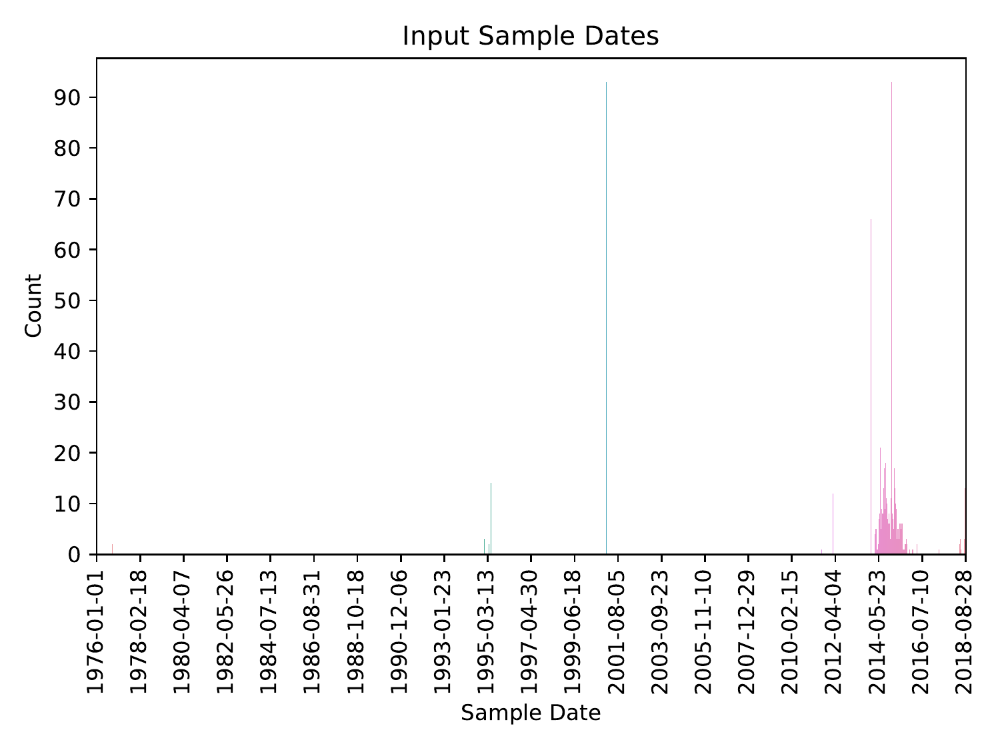
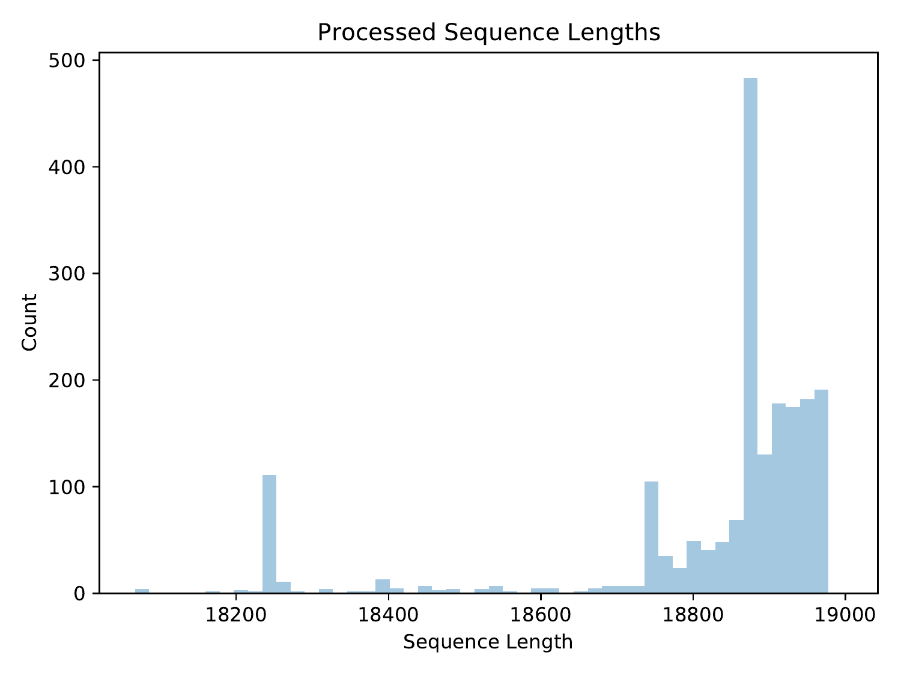
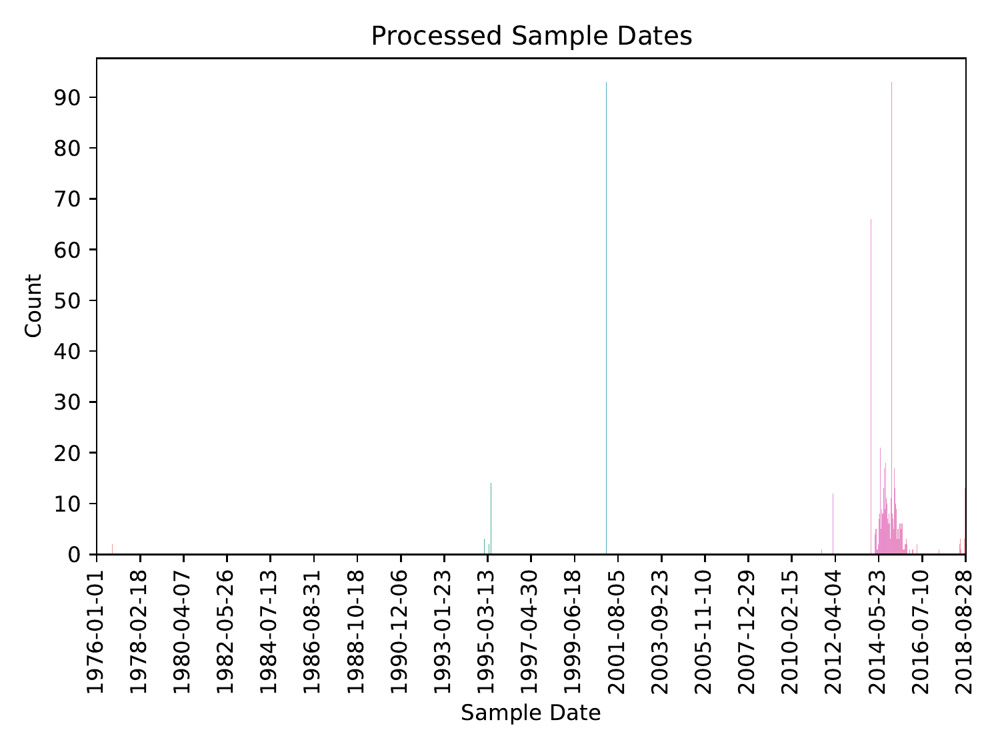
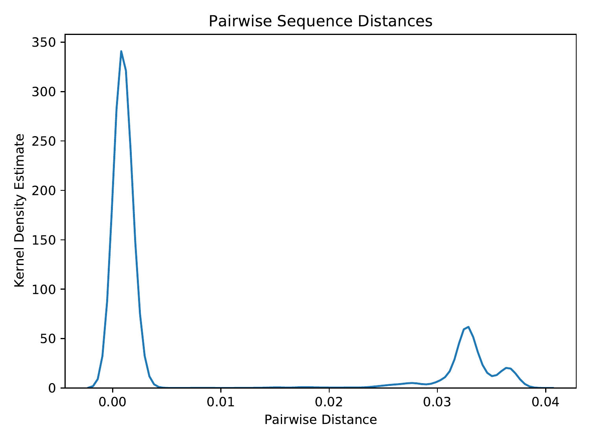
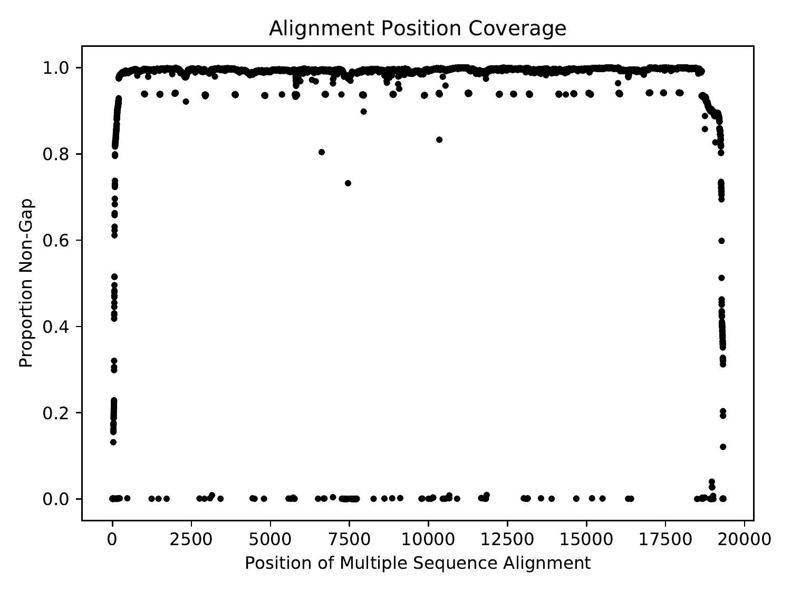
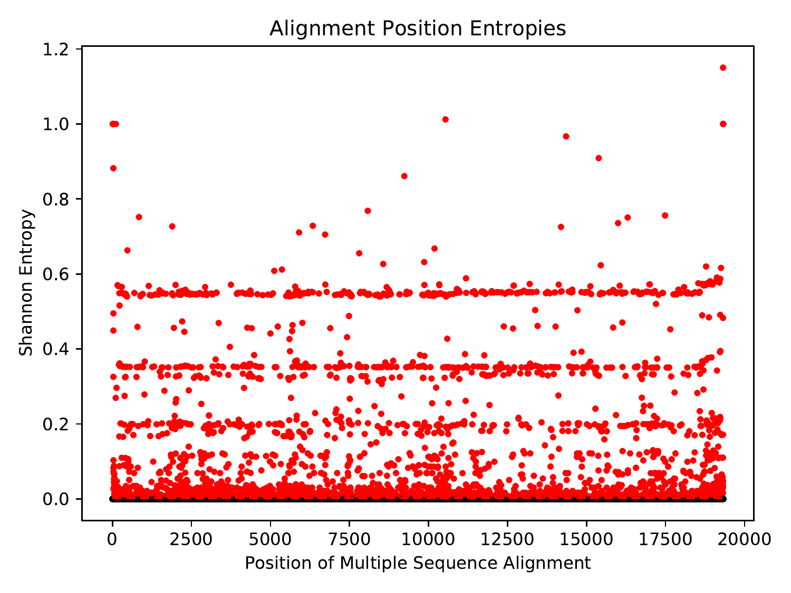
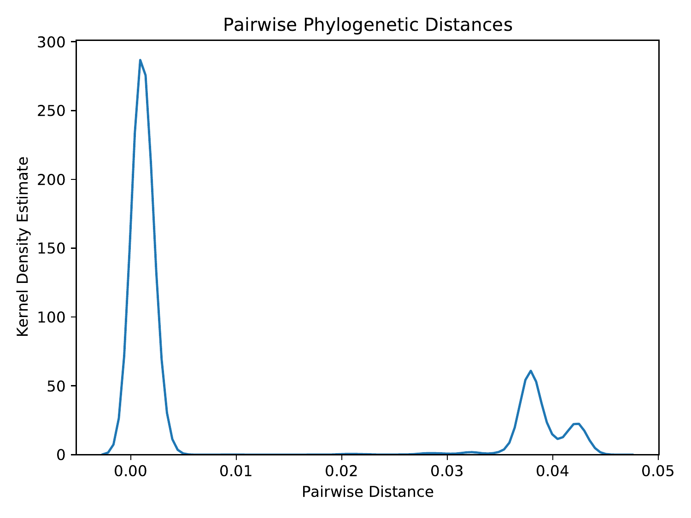
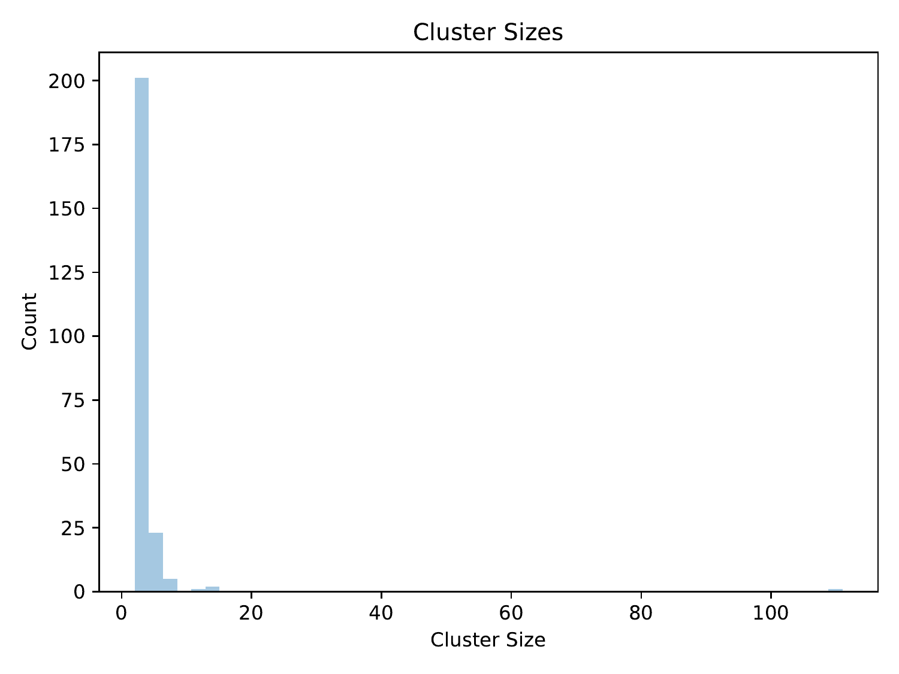

# ViReport v0.0.1 &mdash; 2020-04-19

## Input Dataset
The analysis was conducted on a dataset containing 1945 sequences. The average sequence length was 18823.69, with a standard deviation of 188.283. The earliest sample date was 1976-01-01, the median sample date was 2014-11-15, and the most recent sample date was 2018-09-05.

<figure>

<figcaption>Distribution of input sequence lengths</figcaption>
</figure>

<figure>

<figcaption>Distribution of input sample dates</figcaption>
</figure>

## Preprocessed Dataset
The input dataset was preprocessed such that sequences were given safe names: non-letters/digits in sequence IDs were converted to underscores. After preprocessing, the dataset contained 1945 sequences. The average sequence length was 18823.69, with a standard deviation of 188.283. The earliest sample date was 1976-01-01, the median sample date was 2014-11-15, and the most recent sample date was 2018-09-05.

<figure>

<figcaption>Distribution of preprocessed sequence lengths</figcaption>
</figure>

<figure>

<figcaption>Distribution of preprocessed sample dates</figcaption>
</figure>

## Multiple Sequence Alignment
Multiple sequence alignment was performed using MAFFT (Katoh & Standley, 2013) in automatic mode. There were 19328 positions (581 invariant) and 1778 unique sequences in the multiple sequence alignment. Pairwise distances were computed from the multiple sequence alignment using the tn93 tool of HIV-TRACE (Pond et al., 2018). The average pairwise sequence distance was 0.00832, with a standard deviation of 0.0135.

<figure>

<figcaption>Distribution of pairwise sequence distances</figcaption>
</figure>

Across the positions of the multiple sequence alignment, the minimum coverage was 0, the maximum coverage was 1, and the average coverage was 0.967, with a standard deviation of 0.144.

<figure>

<figcaption>Coverage (proportion of non-gap characters) across the positions of the multiple sequence alignment</figcaption>
</figure>

 Across the positions of the multiple sequence alignment that had non-zero Shannon entropy, the minimum Shannon entropy was 0.00636, the maximum Shannon entropy was 1.15, and the average Shannon entropy was 0.124, with a standard deviation of 0.189.

<figure>

<figcaption>Shannon entropy across the positions of the multiple sequence alignment. Due to the abundance of zero-entropy positions, all non-zero entropies were deemed significant. The significance threshold is shown as a red dashed line, and significant points are shown in red.</figcaption>
</figure>

## Phylogenetic Inference
A maximum-likelihood phylogeny was inferred under the General Time-Reversible (GTR) model (Tavare, 1986) and under the FreeRate model of rate heterogeneity across sites (Soubrier et al., 2012) with sites allowed to be invariable using IQ-TREE (Nguyen et al., 2015). The inferred phylogeny was MinVar-rooted using FastRoot (Mai et al., 2017).

<figure>

<figcaption>Rooted phylogenetic tree in unit of expected per-site mutations</figcaption>
</figure>

Pairwise distances were computed from the phylogeny using TreeSwift (Moshiri, 2020). The maximum pairwise phylogenetic distance (i.e., tree diameter) was 0.0449, and the average pairwise phylogenetic distance was 0.00987, with a standard deviation of 0.0159.

<figure>

<figcaption>Distribution of pairwise phylogenetic distances</figcaption>
</figure>

## Phylogenetic Dating
The rooted phylogeny was dated using treedater (Volz & Frost, 2017). The height of the dated tree was 131806.311 days, so given that the most recent sample was collected on 2018-09-05, the estimated time of the most recent common ancestor (tMRCA) was 1657-10-20.

<figure>

<figcaption>Dated phylogenetic tree in unit of years</figcaption>
</figure>

## Ancestral Sequence Reconstruction
Ancestral sequence reconstruction was performed using TreeTime (Sagulenko et al., 2018).
## Transmission Clustering
Transmission clustering was performed using TreeN93 (Moshiri, 2018) using pairwise phylogenetic distances. The total number of singletons (i.e., non-clustered individuals) was 1148, and the total number of clusters (excluding singletons) was 233. The average cluster size (excluding singletons) was 3.421, with a standard deviation of 7.282, and the maximum and minimum cluster sizes were 111 and 2, respectively.

<figure>

<figcaption>Distribution of cluster sizes (excluding singletons)</figcaption>
</figure>

## Citations

* Katoh K., Standley D.M. (2013). "MAFFT Multiple Sequence Alignment Software Version 7: Improvements in Performance and Usability". Molecular Biology and Evolution. 30(4), 772-780.
* Mai U., Sayyari E., Mirarab S. (2017). "Minimum Variance Rooting of Phylogenetic Trees and Implications for Species Tree Reconstruction". PLoS ONE. 12(8), e0182238.
* Moshiri N. (2018). "TreeN93: a non-parametric distance-based method for inferring viral transmission clusters". bioRxiv.
* Moshiri N. (2020). "TreeSwift: a massively scalable Python tree package". SoftwareX. In press.
* Moshiri N. (2020). "ViReport" (https://github.com/niemasd/ViReport).
* Nguyen L.T., Schmidt H.A., von Haeseler A., Minh B.Q. (2015). "IQ-TREE: A fast and effective stochastic algorithm for estimating maximum likelihood phylogenies". Molecular Biology and Evolution. 32(1), 268-274.
* Pond S.L.K., Weaver S., Leigh Brown A.J., Wertheim J.O. (2018). "HIV-TRACE (TRAnsmission Cluster Engine): a Tool for Large Scale Molecular Epidemiology of HIV-1 and Other Rapidly Evolving Pathogens". Molecular Biology and Evolution. 35(7), 1812-1819.
* Sagulenko P., Puller V., Neher R.A. (2018). "TreeTime: Maximum-likelihood phylodynamic analysis". Virus Evolution. 4(1), vex042.
* Volz E.M., Frost S.D.W. (2017). "Scalable relaxed clock phylogenetic dating". Virus Evolution. 3(2), vex025.

